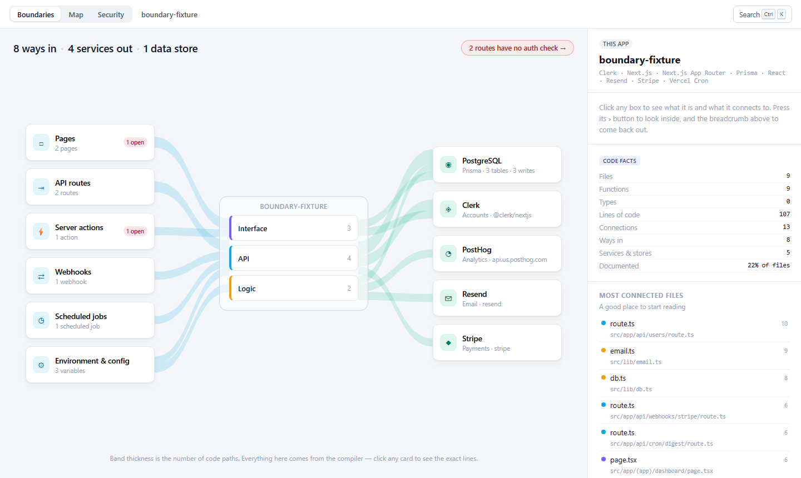
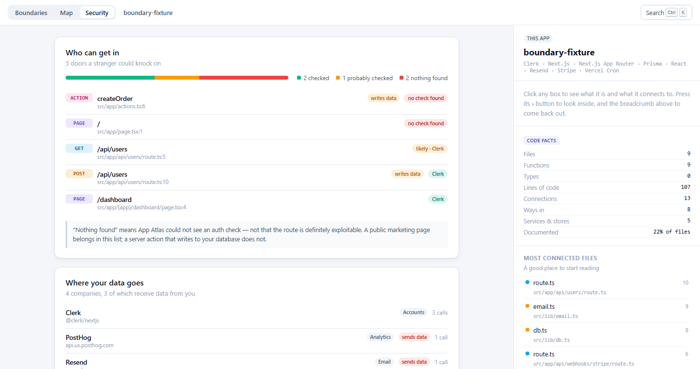
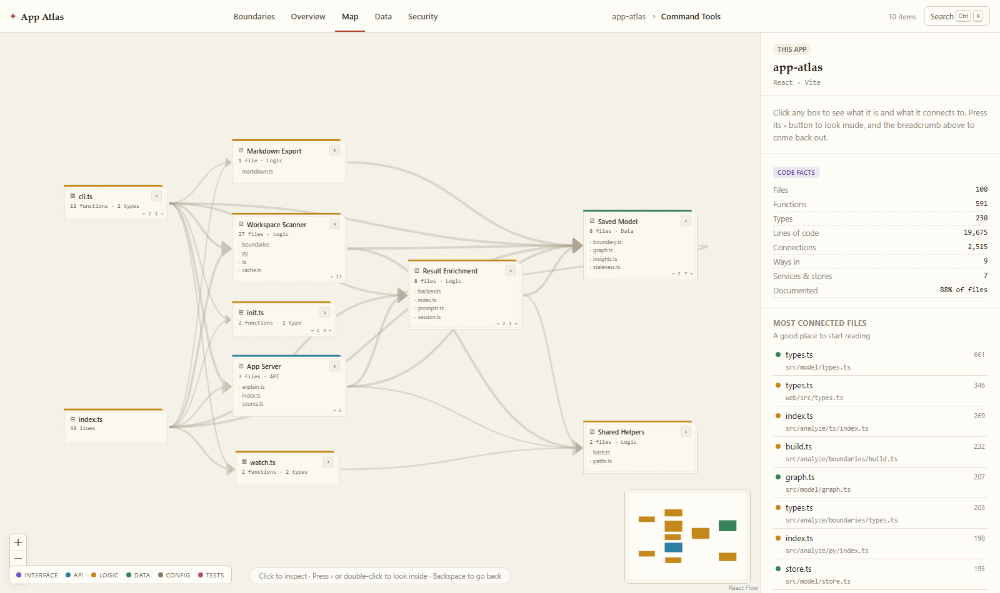
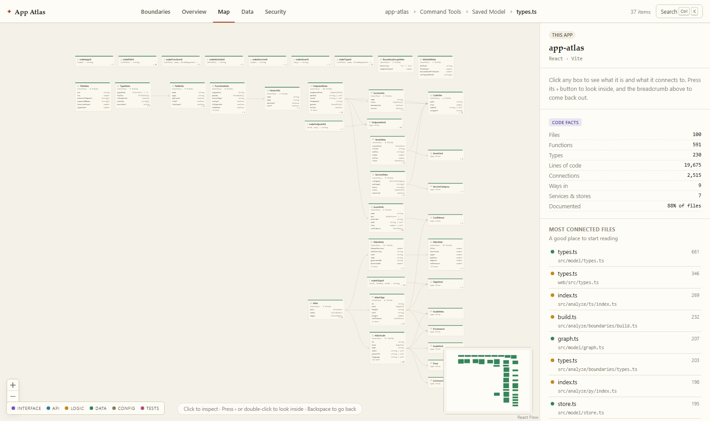

# App Atlas

> **Understand any app — including the one your AI built.**

Run one command in any project and get an interactive, always-accurate map of your
application: every way data gets in, everywhere it goes, and what all the pieces in
between actually do.



---

## Why this exists

A lot of people now ship real software without writing it. You steer a coding agent,
the code appears, it works — and you cannot answer basic questions about your own
product. Where does data come in? What does this file do? What breaks if I delete
this? Which of my routes have no auth on them?

Every existing code-visualization tool assumes a reader who can already read the
code. App Atlas is built for the person who can't — and it turns out professional
developers don't have a good answer to those questions either.

Two rules keep it trustworthy:

1. **Facts come from the compiler.** The structure you see — files, functions, types,
   who-uses-what — is derived by the TypeScript type checker. It is not an LLM's
   impression of your codebase, so it cannot be subtly wrong.
2. **Words come from your code first.** Descriptions are read verbatim from your own
   docstrings when they exist. Generated explanations fill only the gaps, and
   everything is labelled with where it came from.

## Status

**Early development.** Milestones M1 and M2 are complete: the CLI, the
TypeScript/JavaScript analyzer, the atlas data model, the drill-down architecture map,
the boundary view and the security badges all work on real repositories. Plain-English
explanations are next — see [the roadmap](#roadmap) and [SPEC.md](SPEC.md) for the full
design.

## Quick start

Requires **Node 22.5 or newer** (App Atlas uses Node's built-in SQLite, so there is
nothing to compile).

```bash
git clone https://github.com/nhorto/App-Atlas.git
cd App-Atlas
npm install
npm run build
```

Then point it at any project:

```bash
node dist/node/cli.js "C:\path\to\your\project"
```

The analyzer runs, writes the atlas into `.app-atlas/` inside that project, and opens
the map in your browser.

### Commands

| Command | What it does |
|---|---|
| `app-atlas [dir]` | Analyze, then open the map |
| `app-atlas analyze [dir]` | Analyze only, write the atlas to disk |
| `app-atlas serve [dir]` | Serve an atlas that was already analyzed |

### Options

| Flag | Meaning |
|---|---|
| `-p, --port <n>` | Port for the local server (default 4477) |
| `--no-open` | Don't open a browser |
| `--no-refs` | Skip the symbol-reference pass — much faster on very large repos |
| `--max-files <n>` | Cap on files analyzed (default 5000) |
| `--json <path>` | Also write the JSON export somewhere specific |
| `-q, --quiet` | Less output |

## The three views

### Boundaries — the home screen

Every door into your app on the left, your app in the middle, everywhere your data
goes on the right. Band thickness is the number of code paths. It knows about:

- **Routes and pages** — Next.js App Router and Pages Router, Express, Fastify, Hono,
  Koa, NestJS controllers, tRPC procedures
- **Server actions**, the quietest door in a Next.js app: an exported async function
  any browser can invoke
- **Webhooks**, recognised by the signature check rather than the URL
- **Scheduled and background jobs** — `vercel.json` crons, node-cron, BullMQ workers,
  Inngest, Trigger.dev
- **The command line, realtime subscriptions, files read off disk, and every
  environment variable you read**
- **Databases** — Prisma (including the engine and table names from `schema.prisma`),
  Drizzle, Kysely, Knex, pg, Mongoose, Supabase, plus browser `localStorage` and
  IndexedDB, which are easy to forget and mean your data lives on one device
- **Outbound calls** — `fetch`/`axios` with a literal URL resolved to a hostname, and
  official SDKs resolved through the package they came from

### Security — the answers the map implies



Three questions, answered from static facts:

1. **Who can get in.** Every route, page and server action badged with what protects
   it — a middleware matcher, Clerk, NextAuth, Supabase, a tRPC `protectedProcedure`,
   or your own `requireUser`. When the check is in the handler itself the badge is
   definite; when it is a middleware pattern we had to approximate, it says *likely*.
   Claiming a route is protected when it is not would be the most damaging thing this
   tool could do, so it never rounds up.
2. **Where your data goes.** Every company your app sends data to, with the package or
   hostname that proves it.
3. **Configuration and secrets.** Every environment variable you read, where you read
   it, and whether it is documented in `.env.example`.

### Map — the drill-down



- **Click** a box to see what it is, what it uses, and what would break without it.
  Its immediate neighbours light up; everything else dims.
- **Press ›** on a box to go inside it. The breadcrumb takes you back out, as does
  <kbd>Backspace</kbd>.
- **<kbd>Ctrl</kbd>+<kbd>K</kbd>** searches every file, function, type and endpoint.
- Colour always means one thing: which zone something belongs to — interface, API,
  logic, data, config or tests.
- The URL tracks where you are, so you can send someone a link to a specific spot.

Drill all the way into a file and you get its types laid out with their fields, wired
to whatever uses them:



## How it works

```
CLI ──▶ Analyzer ──▶ Atlas model ──▶ Local web app
        (ts-morph)   (SQLite + JSON)  (React Flow + elkjs)
```

- **Analyzer** — [ts-morph](https://ts-morph.com) over the real TypeScript compiler.
  The type checker is the point: knowing what an identifier *resolves to* is what
  separates a real map from a regex guess. Language plugins are an interface from day
  one; Python is next. Boundary detectors ride along on the same traversal, so finding
  every door costs one extra pass, not ten.
- **Atlas model** — a language-agnostic graph of nodes (app, folder, file, function,
  type, endpoint, service, store) and edges (contains, imports, references, reads-from,
  writes-to, exposed-by, protected-by), stored in SQLite with a JSON export any agent
  can read. Every node carries a content hash and a provenance label, which is what
  incremental re-analysis and explanation caching build on.
- **Web app** — one level of the graph on screen at a time, laid out deterministically
  by [elkjs](https://github.com/kieler/elkjs) so the same code always produces the
  same picture. There is no force-directed hairball anywhere in this project, by
  design.

## Roadmap

| | Milestone | Status |
|---|---|---|
| **M1** | CLI, TypeScript analyzer, atlas model, drill-down architecture map | ✅ done |
| **M2** | Framework plugins, boundary detectors, the boundary view, security badges | ✅ done |
| **M3** | Explanations — docstrings first, provider-agnostic AI for the gaps | next |
| **M4** | Type explorer, guided walkthroughs, `ATLAS.md` export for coding agents | |
| **M5** | Incremental re-analysis, `--watch`, Python, monorepo scopes, launch | |

## Development

```bash
npm run build       # build the CLI and the web app
npm test            # end-to-end tests against the built output
npm run typecheck   # both TypeScript projects
npm run dev:web     # Vite dev server (expects `app-atlas serve` running on 4477)
```

Tests run against `dist/`, not `src/`, so they cover what actually ships.

## Contributing

Contributions are welcome, particularly:

- **Language plugins.** The analyzer takes source files and emits atlas nodes and
  edges — see [`src/analyze/plugin.ts`](src/analyze/plugin.ts). Go, Ruby and Rust are
  all wide open.
- **Boundary detectors.** A detector is one small file that recognises one family of
  conventions — see [`src/analyze/boundaries/`](src/analyze/boundaries/). If your
  framework, ORM or auth library is missing, that is the file to add.
- **The service catalog.** [`catalog.ts`](src/analyze/boundaries/catalog.ts) maps
  packages and hostnames to the company behind them. Adding an entry is a one-line PR
  and immediately improves everyone's boundary view.
- **Real-world repos that produce a bad map** — or, worse, a route badged protected
  that is not. Those are the most useful bug reports this project can get.

[SPEC.md](SPEC.md) is the source of truth for the design and explains why each
decision was made, including what was deliberately left out.

## License

MIT — see [LICENSE](LICENSE).
