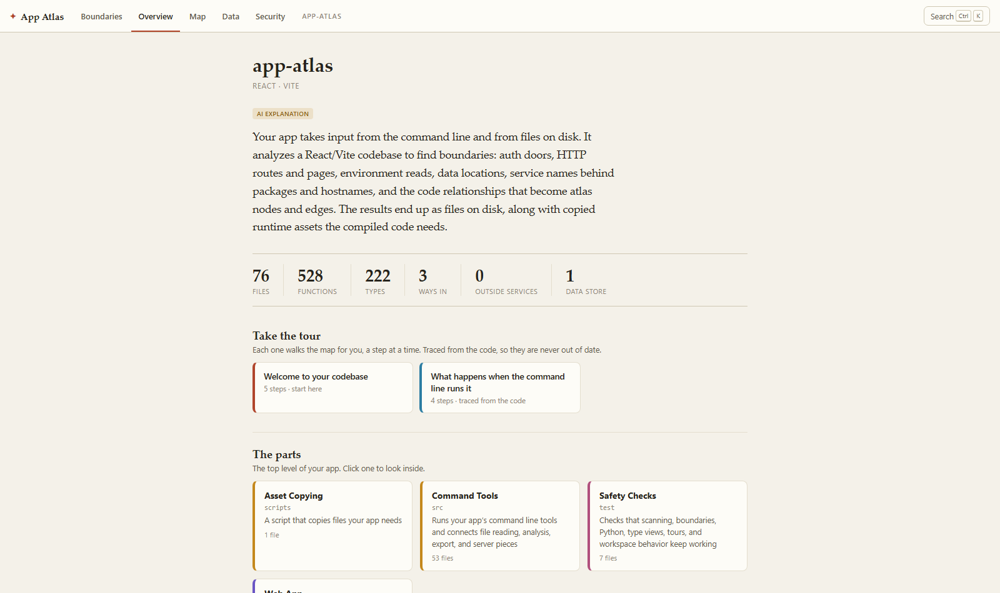
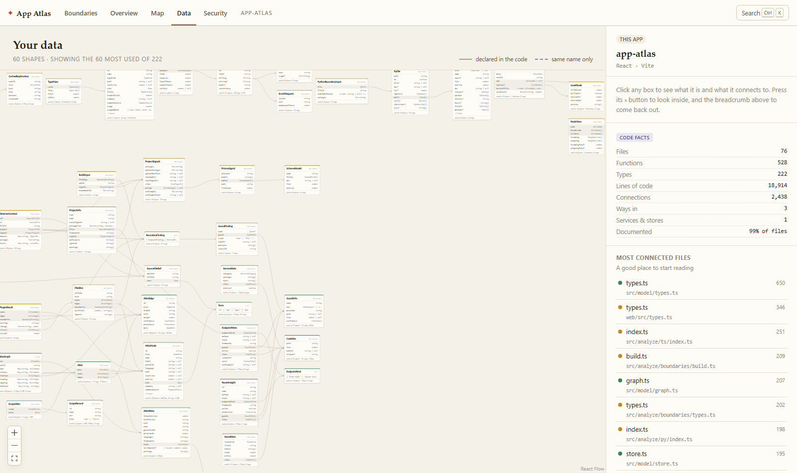
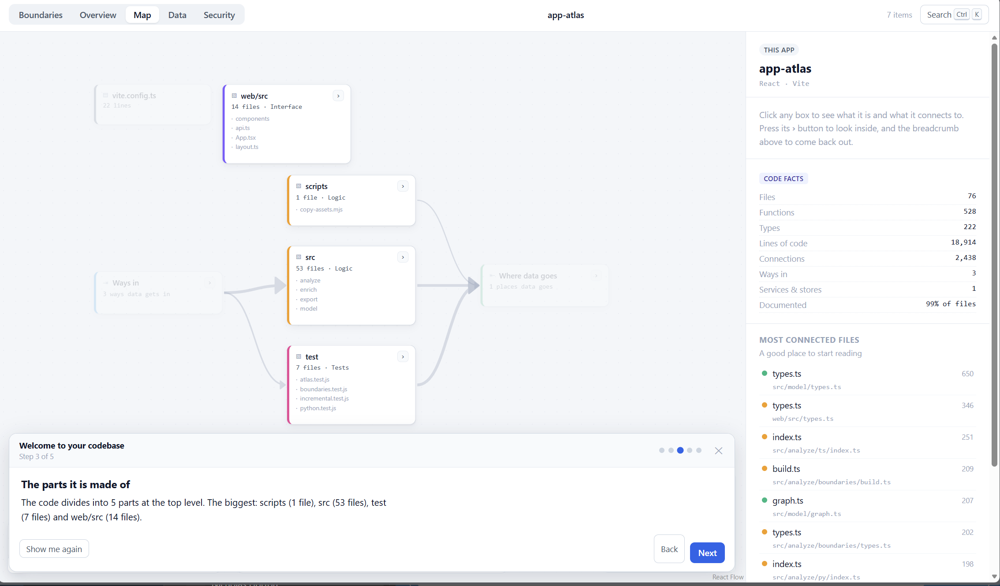

# App Atlas

> **Understand any app — including the one your AI built.**

Run one command in any project and get an interactive, always-accurate map of your
application: every way data gets in, everywhere it goes, and what all the pieces in
between actually do.


---

## Why this exists

A lot of people now ship real software without writing it. You steer a coding agent,
the code appears, it works — and you cannot answer basic questions about your own
product. Where does data come in? What does this file do? What breaks if I delete
this? Which of my routes have no auth on them?

Every existing code-visualization tool assumes a reader who can already read the
code. App Atlas is built for the person who can't — and it turns out professional
developers don't have a good answer to those questions either.

Two rules keep it trustworthy:

1. **Facts come from the compiler.** The structure you see — files, functions, types,
   who-uses-what — is derived by the language's own parser and type checker. It is not
   an LLM's impression of your codebase, so it cannot be subtly wrong.
2. **Words come from your code first.** Descriptions are read verbatim from your own
   docstrings when they exist. Generated explanations fill only the gaps, and
   everything is labelled with where it came from.

## Status

**Milestones M1–M5 are complete.** The CLI, the TypeScript/JavaScript analyzer, the
Python, Go, C# and Rust analyzers, the atlas data model, incremental re-analysis, watch mode, the
drill-down architecture map, the boundary view, the security badges, the plain-English
explanations, the type explorer, guided walkthroughs, monorepo scopes and the
`ATLAS.md` export all work on real repositories. See [the roadmap](#roadmap) and
[SPEC.md](SPEC.md) for the full design.

## Quick start

Requires **Node 22.5 or newer** (App Atlas uses Node's built-in SQLite, so there is
nothing to compile). Python projects also need **Python 3.9 or newer** on the machine
— App Atlas reads Python with Python's own parser rather than guessing at the grammar.

```bash
npx app-atlas .
```

That is the whole install. The analyzer runs, writes the atlas into `.app-atlas/`
inside that project, and opens the map in your browser.

It also takes a path, so you never have to leave the directory you are in:

```bash
npx app-atlas ~/code/the-thing-my-agent-built
```

If you would rather have the command permanently, `npm install -g app-atlas` puts
`app-atlas` on your `PATH`. To work on App Atlas itself, see
[Development](#development).

### Commands

| Command | What it does |
|---|---|
| `app-atlas [dir]` | Analyze, then open the map |
| `app-atlas analyze [dir]` | Analyze only, write the atlas to disk |
| `app-atlas serve [dir]` | Serve an atlas that was already analyzed |
| `app-atlas export [dir]` | Write `ATLAS.md` — the map, for your coding agent |
| `app-atlas mcp [dir]` | Answer your coding agent over the Model Context Protocol |
| `app-atlas init [dir]` | Teach your coding agent to write docstrings as it builds |

### Options

| Flag | Meaning |
|---|---|
| `-p, --port <n>` | Port for the local server (default 4477) |
| `--watch` | Keep watching, and update the map whenever the code changes |
| `--no-open` | Don't open a browser |
| `--no-refs` | Skip the symbol-reference pass — much faster on very large repos |
| `--fresh` | Re-read every file instead of reusing the last run |
| `--scope <name>` | In a monorepo, work on one app only |
| `--ignore <glob...>` | Leave paths out — example apps, vendored code |
| `--max-files <n>` | Cap on files analyzed (default 5000) |
| `--json <path>` | Also write the JSON export somewhere specific |
| `-q, --quiet` | Less output |
| `--no-ai` | Skip generated explanations entirely — docstrings and compiler facts only |
| `--ai-backend <id>` | Force a backend: `claude`, `codex`, `opencode`, `anthropic`, `openai` |
| `--ai-model <name>` | Override the backend's default model |
| `--ai-max-files <n>` | Cap on files described in one pass (default 400) |
| `--ai-yes` | Approve metered API spending in advance, for scripts |
| `--refresh-ai` | Throw away cached descriptions and write them again |
| `--md <path>` | `export` only: where to write the file (default `ATLAS.md`) |
| `--stdout` | `export` only: print it instead of writing a file |

## It knows what kind of project it is looking at

Most code-visualization tools assume a web app. Most repos are not one. Before any
view is chosen, App Atlas works out what kind of thing it is reading — from the doors
the analyzer found, the zones the files fell into, and the frameworks the manifests
declare — and opens on the view that project actually has a question for:

| It is | Because | It opens on |
|---|---|---|
| **An app with a front end** | screens, or routes plus an interface | Boundaries |
| **A service other things call** | routes, and nothing to look at | Boundaries |
| **Something you run** | a command-line entry point or a schedule, and nothing answering a URL | Map |
| **Code other code imports** | exports, and no doors of any kind | Map |
| **A collection of code** | none of the above | Map |

The verdict and the signals behind it are printed on the Overview page, because a
guess that steers the tool is one you have to be able to check and disagree with. It
is derived from the compiler, not from a model.

Nothing is ever hidden by this. A view with nothing in it is set back in the tab bar
rather than removed, and says what was concluded instead of showing an empty diagram —
*"This is code other code imports, so nothing here answers a URL."* Being told you
have no doors is a useful answer; being shown a blank picture is not.

## The five views

Each one answers a different question about the same atlas, and each says so at the
top of the screen:

| View | The question it answers |
|---|---|
| **Boundaries** | What gets into your app, and where it ends up |
| **Overview** | What this app is, and where to start reading |
| **Map** | The code you would open and edit — your real folders and files, and what uses what |
| **Data model** | The data your app keeps — the shapes and tables that outlive a single run |
| **Security** | Who can get in, where your data goes, and what you rely on |

The last two are both a canvas of boxes and lines, which made them read as variations on
one picture. The line that tells them apart is **the Map is the code you change; the Data
model is the data you keep** — and each screen says so by naming the other, with a link
that follows the relationship: a shape on the Data model was written by a file on the Map.

### Boundaries — the home screen

Every door into your app on the left, your app in the middle, everywhere your data
goes on the right. Band thickness is the number of code paths.

**The geometry is fixed; the words change with the kind of project.** Something
arrives on the left, your code is in the middle, something leaves on the right — that
reading order is why this beats a ring diagram — but what those columns *are* depends
on what you built:

| | Left | Right |
|---|---|---|
| An app or a service | What gets in | Where data goes |
| A library | What consumers can call | What it reaches for |
| A script or pipeline | What it reads | What it writes |

For a library that means its **exported names are the doors** — `Functions you can
call`, `Types you can import` — because an exported function is a door, just one
reached through the module system rather than over a network. Public surface versus
internal is invisible in most codebases and it is the thing that breaks semver. Those
doors are real nodes in the atlas, so the detail panel, the tours and `ATLAS.md` all
understand them; and because an import is not a route, they never appear in the auth
coverage count, where a false alarm would be worse than none.

For a script, the same picture is an I/O diagram: the command line and the files it
reads on the left, what it writes on the right.

It knows about:

- **Routes and pages** — Next.js App Router and Pages Router, Express, Fastify, Hono,
  Koa, NestJS controllers, tRPC procedures
- **Server actions**, the quietest door in a Next.js app: an exported async function
  any browser can invoke
- **Webhooks**, recognised by the signature check rather than the URL
- **Scheduled and background jobs** — `vercel.json` crons, node-cron, BullMQ workers,
  Inngest, Trigger.dev
- **The command line, realtime subscriptions, files read off disk, and every
  environment variable you read**
- **Databases** — Prisma (including the engine and table names from `schema.prisma`),
  Drizzle, Kysely, Knex, pg, Mongoose, Supabase, plus browser `localStorage` and
  IndexedDB, which are easy to forget and mean your data lives on one device
- **Outbound calls** — `fetch`/`axios` with a literal URL resolved to a hostname, and
  official SDKs resolved through the package they came from

### Security — the answers the map implies


Three questions, answered from static facts:

1. **Who can get in.** Every route, page and server action badged with what protects
   it — a middleware matcher, Clerk, NextAuth, Supabase, a tRPC `protectedProcedure`,
   or your own `requireUser`. When the check is in the handler itself the badge is
   definite; when it is a middleware pattern we had to approximate, it says *likely*.
   Claiming a route is protected when it is not would be the most damaging thing this
   tool could do, so it never rounds up.
2. **Where your data goes.** Every company your app sends data to, with the package or
   hostname that proves it.
3. **Configuration and secrets.** Every environment variable you read, where you read
   it, and whether it is documented in `.env.example`.

### Overview — what this thing actually is



One paragraph saying what your app takes in, does, and stores; the parts it is made of;
and a ranked list of the files everything else leans on — each with a sentence saying
what it is for. At the bottom, an honest accounting of how much of the page was read
from your own docstrings and how much was generated.

This page is also where the **tours** live — see [Guided tours](#guided-tours).

### Data model — dbdiagram for your code



Every shape your app moves around, on one canvas: interfaces, types, classes and enums
from your code, **and your database tables** read straight out of `schema.prisma`, in
the same picture. A line leaves the row that actually holds the reference, the way a
database diagram draws a foreign key — so you can see that `Order.user` points at
`User` rather than just that the two are somehow related.

- Each card lists its fields, marks the primary key, and says where the shape is used
  and in which parts of the app: *used in 95 places · 51 Data, 40 Logic, 4 API*.
- **Solid lines are declared** — a field's type, or a relation the schema states.
  **Dashed violet lines are only a shared name**: a `User` table and a `User` type are
  usually the same idea, but nothing in the code says so, and App Atlas will not
  pretend otherwise.
- Big codebases show the most-used shapes first and say how many were left out.

### Map — the drill-down


- **Every box is your folder, under its real name.** A generated name is a good headline
  — "Dashboard Panels" beats `app/src/panels` — but it is not something you can search
  for, so it sits underneath, marked `AI`. When the words were written about a cut across
  the folder rather than all of it, the card says so: *The Command Deck · 4 of 89*.
- **An arrow says which of four things it is.** `uses` is imports and calls; `reads` and
  `writes` are your data, in the data zone's own green. A read's arrowhead points at the
  *code*, because that is where the data ends up — the picture and the boundary view now
  agree about which way a query moves.
- **The number on an arrow carries its unit** — `15 imports`, `25 reads`, `43 queries`.
  Fifteen rolled-up connections and fifteen call sites are different facts.
- **The legend is a filter.** Click a zone to switch it off. Tests start off, because
  "what is my app" is not a question test code answers — and the key says what it is
  holding back, with the count, so nothing is ever hidden quietly.
- **Folders** opens the tree as it is on disk: real paths, real names, nothing generated.
  The grouped map says what the parts are; this says where they are.
- **Hover** a box for a one-line answer to "what is this?", with a marker saying
  whether the sentence came from your own docstring or was generated.
- **Click** a box to see what it is, what it uses, and what would break without it.
  Its immediate neighbours light up; everything else dims.
- **Press ›** on a box to go inside it. The breadcrumb takes you back out, as does
  <kbd>Backspace</kbd>.
- **<kbd>Ctrl</kbd>+<kbd>K</kbd>** searches every file, function, type and endpoint.
- Colour always means one thing: which zone something belongs to — interface, API,
  logic, data, config or tests.
- The URL tracks where you are, so you can send someone a link to a specific spot.

Drill all the way into a file and you get its types laid out with their fields, wired
to whatever uses them:


## Guided tours

Instead of reading the map, have it read itself to you. The overview page offers a
short list of walkthroughs, and any door in your app has a **Walk me through what
happens** button:

- **Welcome to your codebase** — five steps: what this is, how the outside gets in,
  the parts it is made of, where your data ends up, and where to start reading.
- **What happens when…** — one per major entry point, traced through the code:
  *what happens when something sends POST to /api/users*, *when an outside service
  calls your webhook at /api/webhooks/stripe*, *when the schedule fires (0 8 \* \* \*)*.



Each step moves the map to the level being discussed, lights up what it is talking
about, and offers the code underneath. You can click away mid-tour to follow your own
thread — **Show me again** puts the step back.

Tours are **derived, not written**. Every step is a traversal of the graph, so they
cost nothing, work with `--no-ai`, and cannot go stale: change the code, re-analyze,
and the tour describes the new code. Where a step quotes a description, it says whether
that came from your docstring or from a model — the paragraph itself is always
compiler fact.

## For your coding agent

The tool exists because agents write code faster than people can read it. The same map
is worth more if the agent reads it too:

```bash
app-atlas export
```

That writes `ATLAS.md` — about 5 KB for a 75-file project — with what the app is, every
door and what guards it, where data goes, the folder map, the database tables and key
types, and where to look first. Then add one line to `CLAUDE.md`, `AGENTS.md` or your
Cursor rules:

```
Read ATLAS.md before changing code. It is the map of this app.
```

Sentences in it that a model wrote are marked `(ai)`; everything else is compiler fact.
Re-run the export after a session and the map is current again. (The full atlas is
plain SQLite and JSON in `.app-atlas/`, so an agent that wants more can query it
directly.)

### Or let it ask questions

`ATLAS.md` is a snapshot you paste. When the agent needs to check one specific thing —
*does the route I just wrote have an auth check?* — it can ask instead:

```bash
claude mcp add app-atlas -- npx -y app-atlas mcp .
```

`app-atlas mcp` is a Model Context Protocol server over stdin and stdout, so any MCP
client can start it. In an `.mcp.json`, `mcp.json` or Cursor's config:

```json
{
  "mcpServers": {
    "app-atlas": { "command": "npx", "args": ["-y", "app-atlas", "mcp", "."] }
  }
}
```

Six tools, over the same graph the screen draws:

| Tool | Answers |
|---|---|
| `unguarded_doors` | Which of my doors is nothing checking — and, counted apart, which are unchecked for a reason |
| `list_doors` | Every way in: routes, server actions, webhooks, crons, queues, exports, screens |
| `what_calls` | Who reaches this function, type or file — the question you ask before changing it |
| `where_is` | Where the thing with this name lives, and what it is for |
| `data_stores` | Every database, bucket and cache, the tables, and what the migrations say guards their rows |
| `env_vars` | Every environment variable the code reads, and whether anyone wrote it down |

Every answer names the file and line it came from, keeps the confidence the analyzer
had, marks any sentence a model wrote, and says when the analysis was run.

The server reads the atlas `analyze` already wrote and never runs one itself — an MCP
client starts its servers at the beginning of a session and a first answer that took
forty seconds would look like a hang. So run `app-atlas analyze` first, and again after
the code changes; `--watch` does it for you and the next tool call picks it up. A
directory nobody has analyzed gets a sentence saying exactly that, not an empty list:
an agent handed an empty list will tell you your app has no unprotected routes.

## It keeps up with your agent

The map is only useful if it is right *now*. Two things make that cheap.

**Only what changed is read again.** Every file's contribution to the atlas — its
nodes, its edges, its boundary findings — is cached under a hash of that file's text.
A second run restores everything you have not edited and never hands it to the
compiler. On this repo that is 4.1s down to 0.3s.

Editing a file also invalidates whatever imports it, because renaming an export
changes the id its callers point at and only re-reading those callers can notice. If
you ever want the paranoid version, `--fresh` re-reads the lot.

**Watch mode closes the loop.**

```bash
app-atlas --watch
```

The map now updates itself while your agent works. Every save triggers a rebuild — the
same pipeline as a normal run, so the two cannot drift — and the open page follows
along without a reload. And it says the thing this tool exists to say:

```
  ↻ src/app/api/orders/route.ts · 0.3s
    1 new route has no auth check App Atlas can see.
```

Watch mode never stops to ask about spending money. A question that appears mid-edit,
repeatedly, is not consent — so a metered API key is quietly declined and a
subscription is unaffected.

## Python, at the good tier

```bash
app-atlas ~/code/my-fastapi-app
```

Python gets the same treatment as TypeScript: files, functions, classes with their
fields, imports, docstrings, and the whole boundary layer — FastAPI, Flask and Django
routes; Celery tasks; SQLAlchemy and Django ORM calls; `requests` and `httpx` with
their literal URLs resolved to the company on the other end; `os.environ` read however
you spell it.

App Atlas reads Python with **Python's own `ast` module**, by shelling out to whatever
interpreter your project already uses — a virtual environment in the project wins, and
`APP_ATLAS_PYTHON` overrides everything. A parser reimplemented in JavaScript would
disagree with the interpreter eventually, and being subtly wrong is the one thing this
tool must not be. If there is no Python on the machine, the files still appear on the
map; they just have no insides — and the run says so, in a warning that distinguishes
"there is no Python here" from "the Python here was too busy to answer in thirty
seconds". Only the first is something for you to go and install. Set
`APP_ATLAS_PYTHON_TIMEOUT`, in seconds, if your machine needs longer than that.

One difference is stated rather than hidden. TypeScript gets a type checker, so "this
identifier is that declaration" is a fact. Python matches a name through the import
that introduced it: inside a file that is as good as certain, across files it is an
inference — and every one of those edges carries **likely** instead of **certain**.
The same rule applies to auth: a FastAPI `Depends(get_current_user)` counts as a
guard, but only ever a likely one, because a function with that name that returns
`None` for a stranger is not a check.

## Go, at the grammar tier

```bash
app-atlas ~/code/my-go-service
```

Go used to produce a blank page. It now produces its files, its packages, its
functions and methods under the types they hang off, its structs and interfaces with
their fields, its doc comments read verbatim — and its boundary: routes on `net/http`
(including the `"GET /orders/{id}"` patterns Go 1.22 introduced), chi, Gin, Echo,
gorilla/mux and Fiber, with sub-routers and groups composed into the address a
customer actually types; `database/sql`, GORM, sqlx, Redis and MongoDB calls with the
table named and the direction read out of the SQL; `os.Getenv`; and outbound HTTP with
the host resolved to the company on the other end.

**Middleware is judged by what it writes, not by what it is called.** `r.Use(Logger)`
and `r.Use(RequireAuth)` are the same line of code. Only one of them ever puts a 401 or
a 403 on the wire, and that — followed up to three calls deep, because real auth code
hands off — is what makes it a check.

There is no Go toolchain involved and none is needed: the grammar is a 212 KB
WebAssembly file this repo ships, taken from [tree-sitter-go][ts-go] and checked
against a recorded hash. Nothing compiles at install time.

The trade is stated everywhere the tool speaks. TypeScript gets a type checker and
Python gets the interpreter's own parser; Go gets a grammar and no resolution at all,
so a name is matched rather than resolved and every link between files says **likely**.
`ATLAS.md` says so in its header, and the CLI says so above the numbers.

[ts-go]: https://github.com/tree-sitter/tree-sitter-go

## C#, at the same tier

```bash
app-atlas ~/code/my-dotnet-api
```

A .NET service gets its files, its namespaces, its classes, interfaces, records and
structs with their properties, its methods under the types they hang off, and its `///`
doc comments read verbatim — and its boundary, in both of the styles ASP.NET Core is
written in.

**Controllers.** `[Route("api/v1/[controller]")]` on the class and `[HttpGet("{id}")]`
on the action are two halves of one address; App Atlas puts them back together, token
substitution included, so the map shows `GET /api/v1/orders/{id}` — the URL a customer
types, not the two fragments it was written as.

**Minimal APIs.** `app.MapGet("/health", …)`, and `app.MapGroup("/admin")` prefixes
composed through however many levels a versioned API nests them.

**Locks, in the direction that matters.** `[Authorize]` on a controller locks every
action under it, and `[AllowAnonymous]` on one action unlocks that one — which is how
nearly every .NET app writes its sign-in route. Reading the class attribute alone would
badge the one deliberately-open door as protected, and being wrong in that direction is
the worst thing this tool can do. `.RequireAuthorization()` chained onto a minimal-API
route counts the same way.

**Data.** A `DbContext` writes its tables down as `DbSet<T>` properties, which is a
better list than any query could give you: every table the app knows about, declared, in
one place. Dapper's tables are read out of the SQL. `Where` and `Select` are LINQ before
they are Entity Framework, so they only count as a query when written on a `DbSet` the
file actually declared — a map that reports a `List<string>` as a table has invented
somebody's schema.

**Visibility is read from the word `public`,** not from the capital letter. Every C#
style guide says public members are PascalCase, so the convention would even be right
most of the time — and it would be a convention presented as a fact.

**Desktop apps get their screens.** A WinUI or WPF window is instantiated by its markup
and by nothing else, so App Atlas reads the `.xaml` beside the code: `x:Class` is the
class the markup completes, a `Window` or a `Page` is a screen somebody opens, and
`Click="OnRefresh"` is a method the framework calls that nothing in the code ever
mentions. Without them a desktop app looks like a library with no way in — which is what
`<OutputType>WinExe</OutputType>` also settles, for a console app with no markup at all.

**What links two C# files** is a `using` plus a type this file actually names. Nothing in
C# names a file, so the pair is the evidence, and the link is marked `likely` because a
name matched a name.

The grammar is a WebAssembly file this repo ships, from [tree-sitter-c-sharp][ts-cs] and
checked against a recorded hash. No .NET SDK is involved and none is needed. The same
trade Go makes applies here and is stated in the same places: a grammar, no resolution,
links between files marked **likely**.

[ts-cs]: https://github.com/tree-sitter/tree-sitter-c-sharp

## Rust, at the same tier

```bash
app-atlas ~/code/my-tauri-app
```

The language that used to be the biggest blank on a mixed repo's map — a Tauri desktop
app keeps its whole engine in Rust, and a 12,000-line crate the map does not mention is
a map that moves the centre of gravity of the app. A Rust crate now gets its files, its
functions and methods under the types their `impl` blocks name, its structs, enums and
traits with their fields, and its `///` and `//!` doc comments read verbatim — including
the ones sitting above a `#[derive(…)]`, which is where Rust actually puts them.

**The module system is read as the language defines it.** `mod estimating;` is the
include it is, `use crate::modules::estimating::load_estimates` is followed to the file
that declares it, and `pub` — the word, not a naming convention — is what makes a name
part of the crate's surface. `pub(crate)` deliberately does not count: it is visible
inside the crate and no further, and rounding it up is the direction this tool never
rounds.

**`#[tauri::command]` is a door.** It is how anything reaches a desktop app's engine,
so it appears on the boundary — under its own family, *Commands your screens call* —
and never in the auth coverage count, because the caller is the app's own interface and
"no auth check" on one would be a false alarm.

**Data through sqlx**, with the table and the direction read out of the SQL itself, the
macro and function forms alike; and every `std::env::var` in the config inventory.

**Vendored crates and `target/` never reach the map.** A repo carrying `cargo vendor`
output or a warm build directory would otherwise drown its own source — the repo that
asked for this plugin had 77 files of somebody else's MySQL driver in `vendor/`.

The grammar is a WebAssembly file this repo ships, from [tree-sitter-rust][ts-rs] and
checked against a recorded hash. No Rust toolchain is involved and none is needed. The
same trade Go and C# make applies here and is stated in the same places: a grammar, no
resolution, links between files marked **likely**.

[ts-rs]: https://github.com/tree-sitter/tree-sitter-rust

## Monorepos get one map each

```
  3 packages in this workspace, 2 of them apps

  api  1 file · 1 way in    1 of 1 routes unprotected
  web  2 files · 2 ways in  2 of 2 routes unprotected
  ui   1 file
```

App Atlas reads the package list from npm, yarn, pnpm, uv or Poetry — whichever one
declared it — and gives every app its own atlas, with a switcher at the top of the
page. One map of six apps is exactly the hairball this tool exists to avoid, and "my
web app" is how people talk about their own repo anyway.

Each app keeps its atlas and its cache in its own directory, so `app-atlas apps/web`
on its own is the same operation as running it in a repo with one app in it. Use
`--scope web` to work on one without leaving the root.

## Where the words come from

Structure comes from the compiler. Sentences come from a ladder, and the rung is
always shown on screen:

1. **Your own docstrings**, used verbatim. Free, instant, versioned with the code, and
   better than anything generated after the fact — the person who wrote the docstring
   knew the intent.
2. **A generated description**, only where no docstring exists.
3. **Nothing but compiler facts**, under `--no-ai`. Always works, always offline.

If a docstring stops matching its code, App Atlas notices. Bodies and docstrings are
hashed separately, so when the body changes and the comment doesn't, it gets badged
*may be outdated* rather than repeated as though it were still true.

**A generated name is labelled the same way a generated sentence is.** Folders get
plain-English headlines, and for a while those were presented as the structure itself —
so a reader looking for "Estimating Toolkit" in their editor was searching for a string
that does not occur in their repo. Every screen now leads with the folder's own name and
marks the generated one underneath. Where a description was written about a group that is
smaller than the box standing for it, the card prints both numbers rather than the one
that flatters.

### It uses the AI subscription you already have

Most people building this way have a Claude Code or Codex subscription, not an API
key. App Atlas runs enrichment through whichever agent CLI it finds on your machine,
in headless mode, so explanations cost nothing extra and need no setup:

```bash
app-atlas analyze .
```

Failing that, it uses `ANTHROPIC_API_KEY`, or `OPENAI_API_KEY` with any
OpenAI-compatible endpoint — which covers OpenAI, OpenRouter, and a local model through
Ollama or LM Studio via `OPENAI_BASE_URL`.

**You are asked before anything is spent, and only when there is something to spend.**
A subscription is free at the margin, so interrupting you for it would be friction with
nothing on the other side; the run just tells you afterwards what wrote the
descriptions. An API key gets a real question first, with the number of items, an
estimate rounded up, and a note of what leaves your machine. Answers are cached against
the facts they were derived from, so unchanged code is never paid for twice.

### Make it free

```bash
app-atlas init
```

Writes a short convention block into your `AGENTS.md` / `CLAUDE.md` asking your coding
agent to document as it builds. Your agent then writes the docstrings, App Atlas reads
them verbatim, and the amount it needs to generate — and so the cost — trends toward
zero. Your codebase ends up documented as a side effect of being mapped.

## How it works

```
CLI ──▶ Analyzer ──▶ Atlas model ──▶ Enricher ──▶ Local web app
        (ts-morph)   (SQLite + JSON)  (your CLI    (React Flow + elkjs)
                                       or any API)      │
                                              ATLAS.md ─┘
```

- **Analyzer** — [ts-morph](https://ts-morph.com) over the real TypeScript compiler,
  and Python's own `ast` module for Python. The checker is the point: knowing what an
  identifier *resolves to* is what separates a real map from a regex guess. Language
  plugins are an interface, and the two shipped ones sit at deliberately different
  depths to prove that interface tolerates it. Boundary detectors ride along on the
  same traversal, so finding every door costs one extra pass, not ten.
- **The cache** — one row per file, keyed by a hash of its text, holding everything
  that file contributed. It works because every edge a file produces starts inside it,
  so slices restore in any order; it stays correct because editing a file also
  invalidates whatever imports it, and because anything project-wide that could change
  an answer (the tool version, the flags, the dependency list, the config files) is
  folded into one fingerprint that discards the lot when it moves.
- **Atlas model** — a language-agnostic graph of nodes (app, folder, file, function,
  type, endpoint, service, store) and edges (contains, imports, references, reads-from,
  writes-to, exposed-by, protected-by), stored in SQLite with a JSON export any agent
  can read. Every node carries a content hash and a provenance label, which is what
  incremental re-analysis and explanation caching build on.
- **Enricher** — a pluggable `run(request)` behind an explanation ladder, a cache keyed
  by the facts each description was derived from, and a validation layer that drops
  anything the model returned about something we never asked about. The tiers are
  batched so one process start buys a dozen descriptions, and per-symbol detail is
  generated only when someone clicks.
- **Web app** — one level of the graph on screen at a time, laid out deterministically
  by [elkjs](https://github.com/kieler/elkjs) so the same code always produces the
  same picture. There is no force-directed hairball anywhere in this project, by
  design.
- **Tours and the export** — both are pure functions of the graph. A walkthrough step
  is a traversal (door → handler → what it calls → where it lands) and `ATLAS.md` is a
  rendering, which is why neither needs a model, a network, or an update when the code
  changes.

## Roadmap

| | Milestone | Status |
|---|---|---|
| **M1** | CLI, TypeScript analyzer, atlas model, drill-down architecture map | ✅ done |
| **M2** | Framework plugins, boundary detectors, the boundary view, security badges | ✅ done |
| **M3** | Explanations — docstrings first, provider-agnostic AI for the gaps | ✅ done |
| **M4** | Type explorer, guided walkthroughs, `ATLAS.md` export for coding agents | ✅ done |
| **M5** | Incremental re-analysis, `--watch`, Python, monorepo scopes | ✅ done |

After v1.0, in rough order of how useful they'd be: a "what changed" overlay that shows
what your agent just did to the map, with the new routes glowing; cross-package tracing
so a monorepo can follow a call from the web app through a shared package into the API;
and more language plugins — the seam is proven now that Go, C# and Rust all go through it.
(The MCP server that used to head this list shipped — see
[Or let it ask questions](#or-let-it-ask-questions).)

## Development

```bash
git clone https://github.com/nhorto/App-Atlas.git
cd App-Atlas
npm install
npm run build
```

```bash
npm run build       # build the CLI and the web app
npm test            # end-to-end tests against the built output
npm run typecheck   # both TypeScript projects
npm run dev:web     # Vite dev server (expects `app-atlas serve` running on 4477)
```

Tests run against `dist/`, not `src/`, so they cover what actually ships. The Python
tests skip themselves when there is no Python 3.9+ on the machine, so working on the
TypeScript side never requires installing one.

`build:node` compiles TypeScript and then copies
[`extract.py`](src/analyze/py/extract.py) into `dist/` — it is source for a different
language, so `tsc` will not do it.

App Atlas maps itself: [`ATLAS.md`](ATLAS.md) in this repo is its own export, and
[`AGENTS.md`](AGENTS.md) was written by `app-atlas init`. Regenerate both after a
change with:

```bash
node dist/node/cli.js analyze . -q --ignore "test/fixtures/**" && node dist/node/cli.js export .
```

The `--ignore` matters: `test/fixtures/` holds small deliberately-insecure apps, and
without it App Atlas reports *their* unprotected routes as its own. Any repo that
ships example code has the same problem.

## Contributing

See [CONTRIBUTING.md](CONTRIBUTING.md) for setup and the one rule everything else
follows. Contributions are welcome, particularly:

- **Language plugins.** The cheapest useful contribution in the whole repo. A new
  language in the grammar tier is a row in
  [`scripts/grammars.mjs`](scripts/grammars.mjs), a query file beside
  [`queries/go.scm`](src/analyze/generic/queries/go.scm), and a dialect the size of
  [`go/dialect.ts`](src/analyze/generic/go/dialect.ts) — after which the repo has its
  files, functions, types and imports. Boundary detectors on top are optional and
  separate. Ruby, Java, Kotlin, PHP and Swift are all wide open. The deeper
  tiers are [`src/analyze/ts/`](src/analyze/ts/) and
  [`src/analyze/py/`](src/analyze/py/), at different depths on purpose.
- **Boundary detectors.** A detector is one small file that recognises one family of
  conventions — see [`src/analyze/boundaries/`](src/analyze/boundaries/). If your
  framework, ORM or auth library is missing, that is the file to add.
- **The service catalog.** [`catalog.ts`](src/analyze/boundaries/catalog.ts) maps
  packages and hostnames to the company behind them. Adding an entry is a one-line PR
  and immediately improves everyone's boundary view.
- **AI backends.** A backend is one `run(request)` function plus a `probe()` — see
  [`src/enrich/backends/`](src/enrich/backends/). Everything above it (the ladder, the
  cache, the trust tiers, the consent rules) is provider-independent.
- **Real-world repos that produce a bad map** — or, worse, a route badged protected
  that is not. Those are the most useful bug reports this project can get.

[SPEC.md](SPEC.md) is the source of truth for the design and explains why each
decision was made, including what was deliberately left out.

## License

MIT — see [LICENSE](LICENSE).
